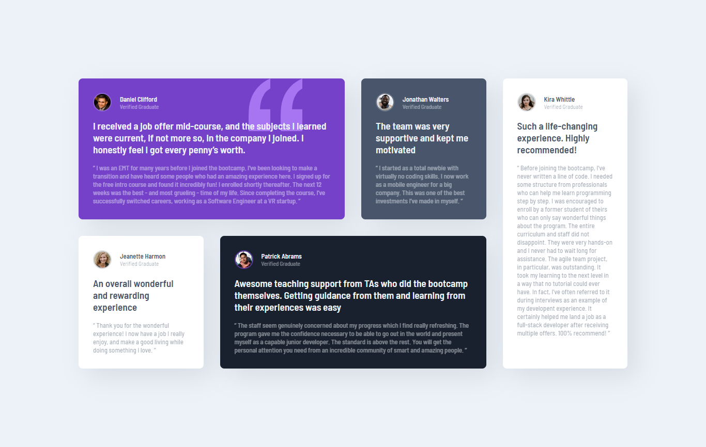

# Frontend Mentor - Testimonials grid section solution

This is a solution to the [Testimonials grid section challenge on Frontend Mentor](https://www.frontendmentor.io/challenges/testimonials-grid-section-Nnw6J7Un7). 

## Table of contents

- [Overview](#overview)
  - [Screenshot](#screenshot)
  - [Links](#links)
- [My process](#my-process)
  - [Built with](#built-with)
  - [What I learned](#what-i-learned)
  - [Useful resources](#useful-resources)
- [Author](#author)

## Overview

### The challenge

Users should be able to:

- View the optimal layout for the site depending on their device's screen size

### Screenshot




### Links

- Solution URL: [Github repo](https://github.com/b16h22/testimonials_grid_section_solution)
- Live Site URL: [Github pages](https://b16h22.github.io/testimonials_grid_section_solution/)

## My process

### Built with

- Semantic HTML5 markup
- CSS custom properties
- CSS Grid

### What I learned

I was able to dig deeperinto CSS Grid and it's possibilities. Learned how to create equal length grid columns. Improved my understanding of child element placements on the grid.

```css
    .grid_container {
      display: grid;
      grid-template-columns: minmax(0,1fr) minmax(0,1fr) minmax(0,1fr) minmax(0,1fr);
      grid-template-rows: auto auto;
      gap: 32px;
      justify-content: center;
      max-height: 100%;
    }
```

### Useful resources

- [CSS Grid](https://www.w3schools.com/CSS/css_grid.asp) - This is a detailed article that helped me understand CSS Grid layout and it's possibilities.

## Author

- Frontend Mentor - [@b16h22](https://www.frontendmentor.io/profile/b16h22)